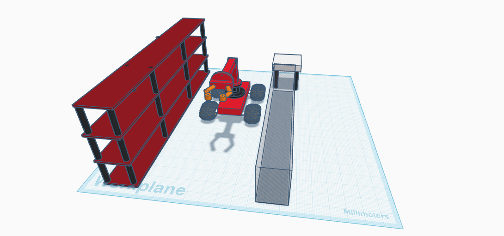
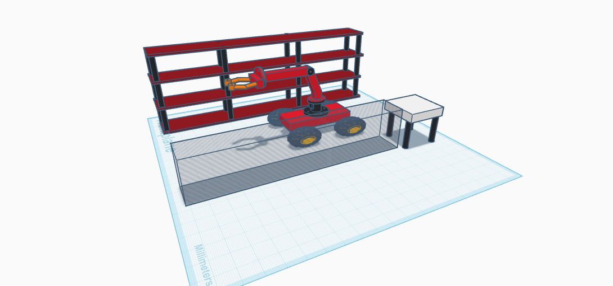
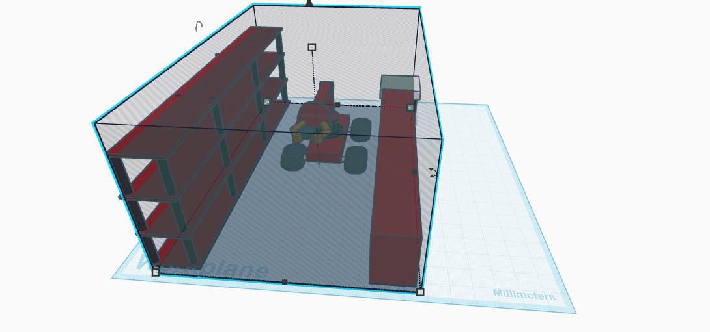
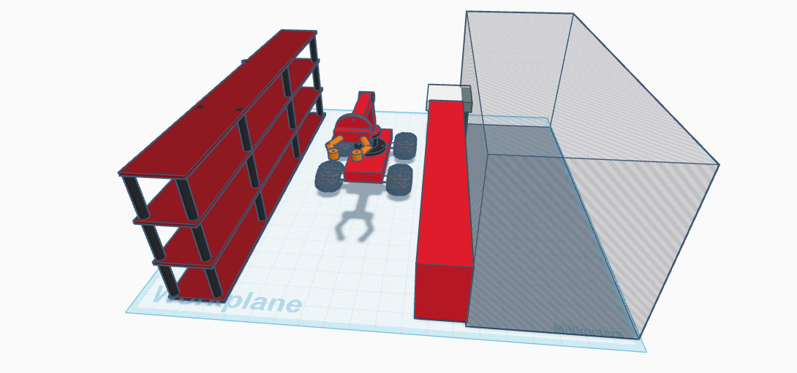

# 3D-Warehouse-Robot


## Project Title  
**3D Design of a Mobile Robotic Arm for Automated Food Warehouse**

---

## Objective  
The goal of this project is to create a **3D model** of a mobile robot in **Tinkercad** that automates tasks in a food warehouse.  
The robot includes a **360° mobile base**, an **articulated arm with elbow**, and a **rotating claw**, simulating real-world warehouse automation without human intervention.

---

## Description  
This robotic system is designed with mobility and flexibility in mind. The key components are:

1. **Mobile Base with 4 Wheels**  
   - Allows movement across the warehouse floor.  
   - Wheels positioned at each corner of the base.

2. **Robotic Arm (Shoulder + Elbow)**  
   - Connected to the center of the base.
   - First arm segment extends from the shoulder joint.
   - Elbow connects to the second arm segment, allowing vertical movement.

3. **Claw (Gripper)**  
   - Located at the end of the arm.
   - Can rotate 360° to adjust object orientation.
   - Designed using 6 cylinders (for gripping).

4. **360° Movement & Reach**  
   - Full base rotation enables the robot to face any direction.
   - The working envelope defines the area the arm can reach.
   - The dead envelope shows zones the robot cannot access (too close or outside reach).

---

## Tools and Platform

- **Platform**: [Tinkercad](https://www.tinkercad.com)   
- **Shapes Used**:  
  - Box (base, arms,claw)  
  - Cylinder (claw, joints, rotations)  
  - Transparent Cylinder (working envelope and dead envelope)

---

## Execution Algorithm

```plaintext
BEGIN
  WHILE robot is powered ON
    IF item_detected THEN
      move_to(item_location)              
      rotate_arm_to(item)
      extend_elbow()
      close_claw()
      IF orientation_needed THEN
        rotate_claw(360)
      ENDIF
      retract_arm()
      move_to(storage_location)
      extend_elbow()
      open_claw()
      return_to_idle()
    ENDIF
  ENDWHILE
END

```
---

## Project Screenshot

Below is a screenshot of the 3D mobile robotic arm model in Tinkercad:





---

## Working Envelope vs Dead Envelope

-  **Working Envelope**:  
  A transparent rectangular around the base showing the maximum area the arm can reach.
  


-  **Dead Envelope**:  
  A transparent rectangular showing the area that is unreachable 
  

---

## Created By  
- **Name**: Aghadi Saleh Al-rebdi   
- **Department**: Computer Science  
- **Year**: 2025  
